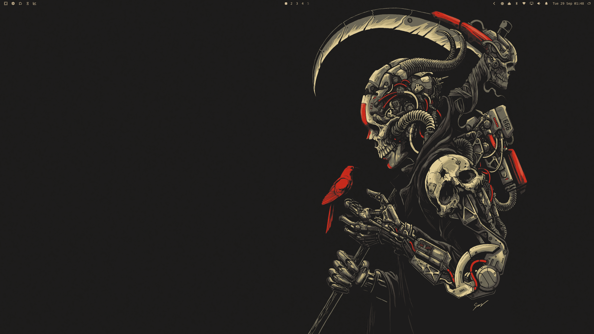
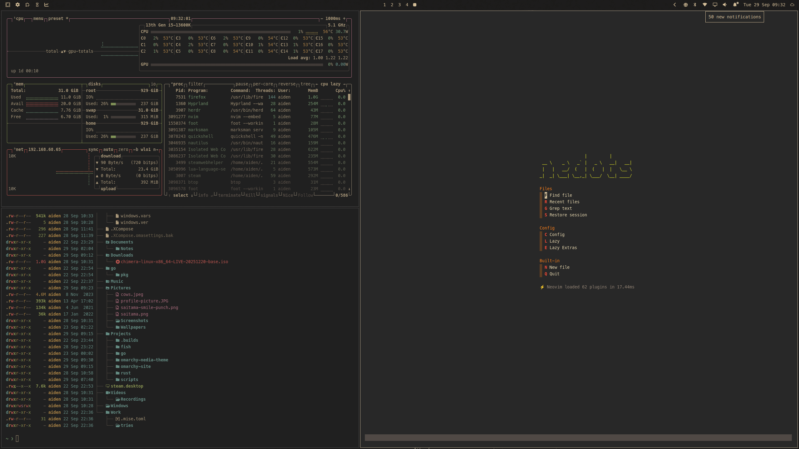
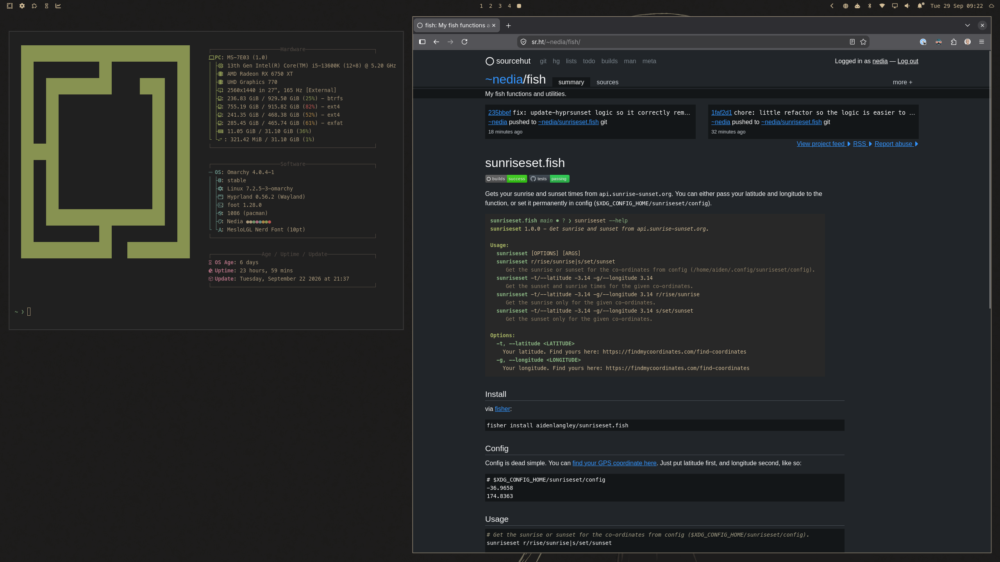

# omarchy-nedia-theme

Basically just the default gruvbox, with [harbordark](https://github.com/HANCORE-linux/omarchy-harbordark-theme) background, and other small tweaks.






## Install

```sh
omarchy theme install https://github.com/aidenlangley/omarchy-nedia-theme.git
```

## Font

`MesloLGL Nerd Font`.

## Hyprland

```lua
hl.config({
  decoration = {
    active_opacity = 1,
    inactive_opacity = 1,

    border_part_of_window = true,

    dim_inactive = true,
    dim_strength = 0.2,

    blur = {
      enabled = true,
    },

    shadow = {
      enabled = true,
    },
  },

  dwindle = {
    default_split_ratio = 0.9,
    split_width_multiplier = 1.1,
  },

  general = {
    border_size = 1,

    gaps_in = 2,
    gaps_out = 4,

    col = {
      active_border = "rgb(bdae93)",
      nogroup_border_active = "rgb(bdae93)",
    },
  },

  group = {
    col = {
      border_active = "rgb(bdae93)",
      border_locked_active = "rgb(bdae93)",
    },

    groupbar = {
      font_size = 12,

      height = 24,
      indicator_height = 0,
    },
  },
})
```

## Plugins

- [Activity Monitor](https://github.com/stappmus/omarchy-activity-monitor)
- [Notification Center](https://github.com/jankeesvw/omarchy-notification-center)
- [Omaland (Hyprland Look 'n' Feel Settings)](https://github.com/bobby-nicholas/omaland)
- [Omaplug (Plugin Manager)](https://github.com/fross100/omaplug)
- [Omasettings (Hyprland Settings)](https://github.com/twiking/omasettings)
- [Radio Atlas](https://github.com/AksharP5/omarchy-radio-atlas)
- [Screentime](https://github.com/ax1g/quickshell-screentime-plugin)

```sh
# Install Plugins
omarchy plugin add https://github.com/AksharP5/omarchy-radio-atlas.git --enable --yes
omarchy plugin add https://github.com/ax1g/quickshell-screentime-plugin.git --enable --yes
omarchy plugin add https://github.com/bobby-nicholas/omaland.git --enable --yes
omarchy plugin add https://github.com/fross100/omaplug --enable --yes
omarchy plugin add https://github.com/jankeesvw/omarchy-notification-center.git --enable --yes
omarchy plugin add https://github.com/stappmus/omarchy-activity-monitor.git --enable --yes
omarchy plugin add https://github.com/twiking/omasettings.git --enable --yes
```

```sh
# Move the plugins to where I've got them...
omarchy bar move omarchy.menu --section left --index 0
omarchy bar move io.github.twiking.omasettings --after omarchy.menu
omarchy bar move omaplug --after io.github.twiking.omasettings
omarchy bar move agx.screen-time --after omaplug
omarchy bar move stappmus.activity-monitor --after agx.screen-time
omarchy bar move omarchy.indicators --after stappmus.activity-monitor

omarchy bar move omarchy.workspaces --section center --index 0

omarchy bar move akshar.radio-atlas --section right --index 0
omarchy bar move omarchy.bluetooth --after akshar.radio-atlas
omarchy bar move omarchy.network --after omarchy.bluetooth
omarchy bar move omarchy.monitor --after omarchy.network
omarchy bar move omarchy.audio --after omarchy.monitor
omarchy bar move jankeesvw.notification-center --after omarchy.audio
omarchy bar move omarchy.clock --after jankeesvw.notification-center
omarchy bar move omarchy.weather --after omarchy.clock
```

## Neovim

```lua
return {
  {
    "ellisonleao/gruvbox.nvim",
    priority = 1000,
    opts = {
      italic = {
        strings = false,
        comments = false,
        operators = false,
        folds = true,
      },
      contrast = "hard",
      transparent_mode = true,
    },
  },
  {
    "LazyVim/LazyVim",
    opts = {
      colorscheme = "gruvbox",
    },
  },
}
```
